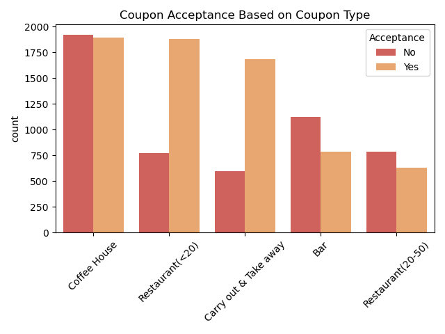
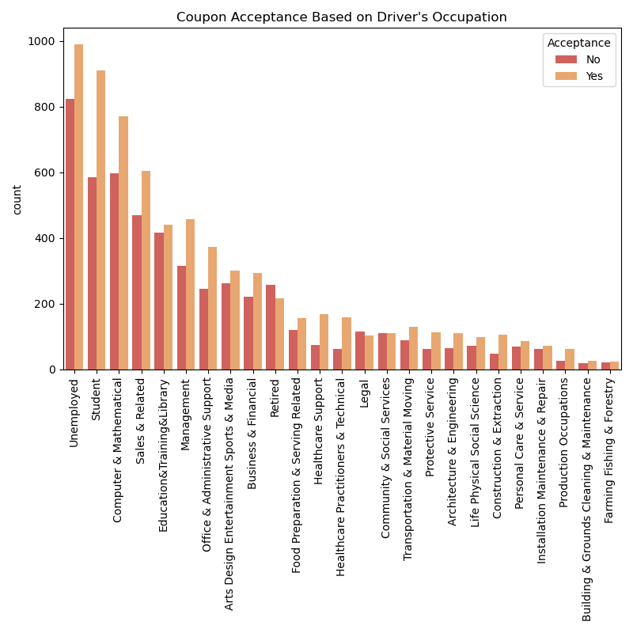
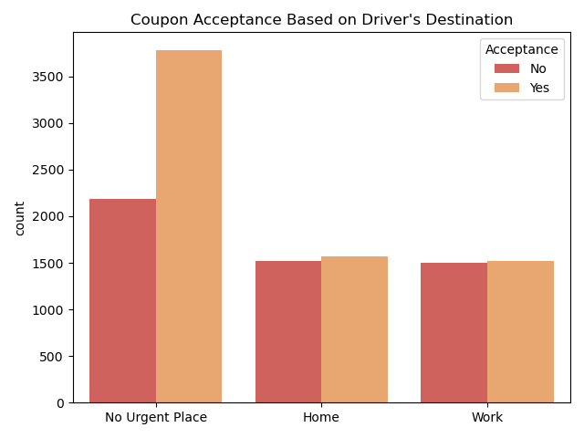
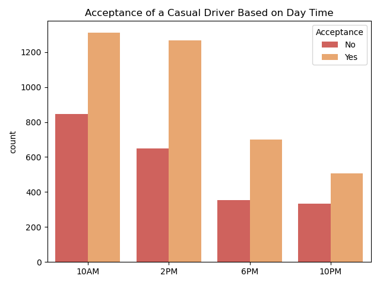
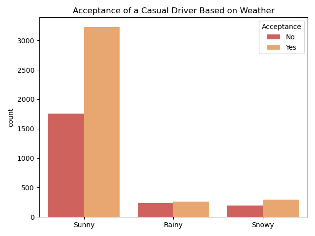

# Berkeley Haas - Professional Certificate in Machine Learning and Artificial Intelligence - Module 5 - Practical Application 1

Table of Contents
- [Background](#background)
- [Will a Customer Accept the Coupon?](#will-a-customer-accept-the-coupon)
- [Exploratory Data Analysis (EDA)](#exploratory-data-analysis-eda)
    - [Overview of Data](#overview-of-data)
    - [Deep Dive into Bars](#deep-dive-into-bars)
    - [Occupation](#occupation)
    - [Traveler's Destination](#travelers-destination)
    - [Next Steps](#next-steps)

## Background

This is a demonstration of application of skills learned during Part 1 of the program; Modules 1 to 5.

## Will a Customer Accept the Coupon?

The data comes from the UCI Machine Learning repository and was collected via a survey on Amazon Mechanical Turk. The survey describes different driving scenarios including the destination, current time, weather, passenger, etc., and then ask the person whether she/he will accept the coupon if she/he is the driver. There are five different types of coupons -- less expensive restaurants (under \$20), coffee houses, carry out & take away, bar, and more expensive restaurants (\$20 - \$50). 

Imagine driving through town and a coupon is delivered to your cell phone for a restaurant near where you are driving. Would you accept that coupon and take a short detour to the restaurant? Would you accept the coupon but use it on a subsequent trip? Would you ignore the coupon entirely? What if the coupon was for a bar instead of a restaurant? What about a coffee house? Would you accept a bar coupon with a minor passenger in the car? What about if it was just you and your partner in the car? Would weather impact the rate of acceptance? What about the time of day?

## Exploratory Data Analysis (EDA)

EDA was performed in following [Jupyter Notebook](prompt.ipynb). You will find in there all the details and steps used to clean and process the data. Technologies and runtime libraries used include: Python, Pandas, Seaborn, Matplotlib, and numpy.

### Overview of Data

It looks like the most accepted coupons were those to inexpensive restaurants or take outs. Bars and expansive restaurants are the least favorite among drivers.

### Deep Dive into Bars

- Only 41.2% of Bar coupons issued were accepted by drivers. This is only 6.5% of all coupons issued.
- People who often visit bars (4 times or more a month) accepted the Bar Coupon 76% of the time. Where are less bar-fly inclined (3 times a month or less) accepted the Bar Coupon only 37% of the time. 
- It looks age does not play significant role in accepting the Bar coupon for people who visit a bar at least 1 time a month or more.
- Ratio of drivers who received and accepted the bar coupon, have no kid passengers, work in industry other than "Farming, Fishing or Forestry" is 71% 
- Ratio of drivers who received and accepted the bar coupon, have no kid passengers, are not widowed: 71%
- Ratio of drivers who received and accepted the bar coupon, are under 30: 72%
- Ratio of drivers who received and accepted the bar coupon, frequently eat at inexpensive resultants, make less than 50k: 46%

### Occupation

We don't have well balanced data set sampling all different occupation categories. 17.6% unemployment rate is pretty high. Maybe the data was sampled in a region economically challenged? Nonetheless, students will most likely accept a coupon.

### Traveler's Destination

People driving casually are more likely to accept a coupon than people driving back home or for work. 

#### Casual Driver

The drivers traveling for pleasure will most likely accept a coupon between 10am and 6pm or on a sunny day.

## Next Steps

It would be necessary to explore geolocation data to the nearest place where the coupons can be redeemed. Not to mention direction of travel needed to get to the advertised place (in the preferred direction of travel or the opposite). Perhaps coupon expiration or driver's education can also influence the decision?
